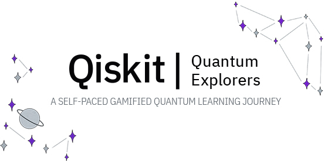

# Quantum Explorers

Quantum Explorers is a self-paced, gamified quantum computing learning program for high school students and above.

It is beginner-friendly, though it increases in difficulty as achievements are unlocked. The theme of the learning journey is space exploration.

Anyone can join from students to industry professionals to quantum enthusiasts! The program is comprised of engaging study materials, seminars, gamified achievements to unlock, and career advice.

Participants will gain a general understanding of quantum computing, some of its applications such as quantum machine learning and quantum optimization, and program real quantum computers.

There are six themed achievements to unlock, with corresponding Badges to collect. Each Badge has a learning module, event, or set of tasks associated with it that must be completed in order to unlock its achievement.

**Location:** This program takes place on a dedicated Discord server. The invite link to the server is provided in the Attendee Guide that is delivered to your email inbox after registration.

**Timeline:** The program will be live from August 2022 to February 2023. Total materials cover approximately 34 to 70 hours spanning over these 6 months. Level of engagement depends on the participant.

**Event flyer:** Feel free to download and circulate the event flyer from [here](https://ibm.box.com/v/qe-event-flyer).

This program leads up to [ICPC’s Algo Queen in February 2023](https://www.amrita.edu/events/icpc-algo-queen-the-girls-programming-cup-2023/), a competitive programming cup sponsored by IBM Quantum. This event is external to Quantum Explorers, but registration for Quantum Explorers will open first for Algo Queen Participants.

Registration opens for Algo Queen Registrants on July 28, 2022. They will be notified via email and receive the registration link in their inbox.

Registration opens to the general public on August 1, 2022 at 6 PM IST | 8: 30 PM EDT. View this time in your own timezone [here](https://dateful.com/convert/indian-standard-time-ist?t=6pm).

Registration form and information can be found on the event website: [qisk.it/quantum-explorers](http://qisk.it/quantum-explorers).

