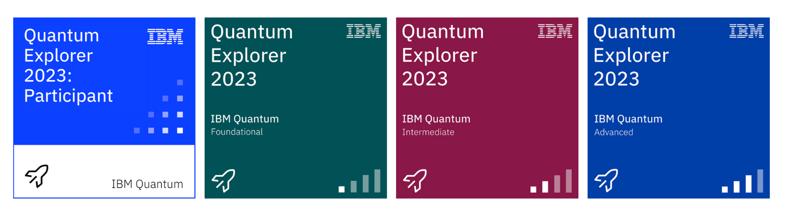

# Quantum Explorers Digital Credentials

Quantum Explorers is our self-paced, game-based quantum computing learning program for high school students and above. There are seven themed achievements to unlock. Each achievement has a learning module, event, or set of tasks associated with it that must be completed in order to unlock its achievement. Based on the number of achievements a learner unlocks, they will be issued an IBM digital credential.

For program information, visit [qisk.it/quantum-explorers](http://qisk.it/quantum-explorers).

##  Badge Pages

Click on the links below for more information about each badge:

- [Participant](https://www.credly.com/org/ibm/badge/quantum-explorer-2023-participant) - 1/3 community achievements
- [Foundational](https://www.credly.com/org/ibm/badge/quantum-explorer-2023-foundational) - 1/4 learning achievements
- [Intermediate](https://www.credly.com/org/ibm/badge/quantum-explorer-2023-intermediate) - 4/4 learning achievements
- [Advanced](https://www.credly.com/org/ibm/badge/quantum-explorer-2023-advanced) - 7/7 total achievements

## Privacy Statement

NOTICE: IBM leverages the services of Credly, a 3rd party data processor authorized by IBM and located in the United States, to assist in the administration of the IBM Digital Badge program. In order to issue you an IBM Digital Badge, your personal information (name, email address, and badge earned) will be shared with Credly. You will receive an email notification from Credly with instructions for claiming the badge. Your personal information is used to issue your badge and for program reporting and operational purposes. IBM may share the personal information collected with IBM subsidiaries and third parties globally. It will be handled in a manner consistent with IBM privacy practices. The IBM Privacy Statement can be viewed [here](https://www.ibm.com/us-en/privacy).

Contact email address: qiskit.events@us.ibm.com 

